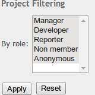

redmine_project_filtering
=========================

Redmine plugin that provides additional controls for filtering projects in the main project list.

The project support the filtering using custom fields.

The plugin has been tested with Redmine 3.0.1: due to time constraints, it has not been tested with previous versions. If you'd like to try it with a previous version, please make sure to edit the `requires_redmine` directive in the `init.rb` file to suit your installation. If it works for you, please let me know and I'll update the `init.rb` file accordingly.

The plugin is available under the terms of the [GNU General Public License](http://www.gnu.org/licenses/gpl-2.0.html), version 2 or later.

For this plugin I used bluezio plugin as starting point:
	https://github.com/bluezio/redmine_project_filtering

Installation
------------

To install this plugin, just clone it into your `plugins` subdirectory:

    cd plugins
    git clone git://github.com/gianlucanatali/redmine_project_filtering

After cloning the repository, you will need to restart your Redmine instance so it picks up the new plugin.

Design notes
------------

The goal of this plugin is to remain as simple as possible: it does not add any new tables or assets itself.

The plugin integrates into Redmine through two advanced mechanisms:

* `lib/project_filtering_hook_listener.rb` has a view hook listener that adds the required HTML to the project list sidebar.
* `lib/project_filtering_project_controller_patch.rb` wraps the `index` method of the `ProjectsController` to add the appropriate filter.

Due to the way the `ProjectsController` is patched, if another plugin wraps the `index` method in the same way, this plugin will stop working. This is a limitation of the ActiveSupport `alias_method_chain` method.
